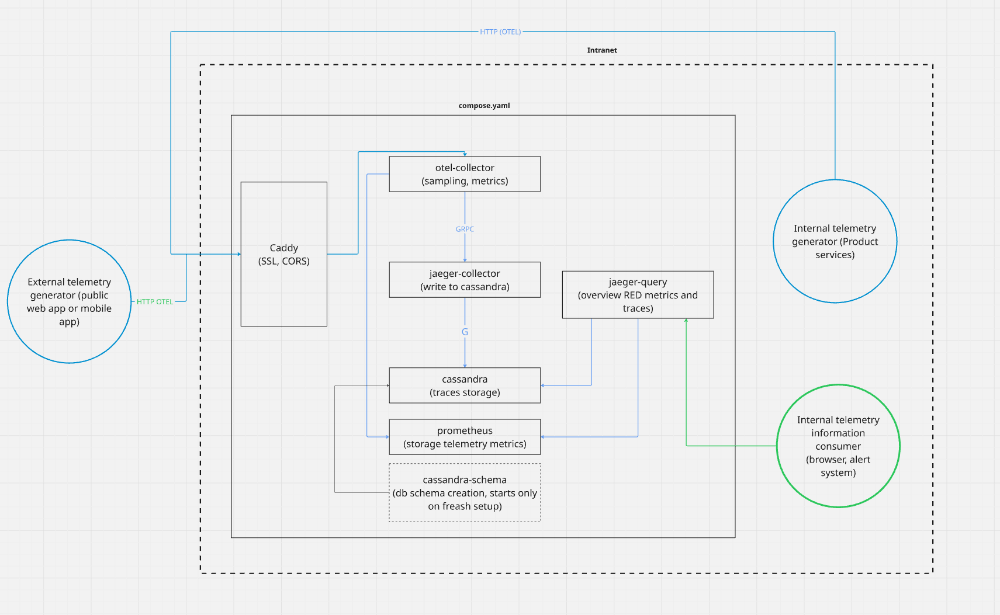

# Telemetry

[](LICENSE)
[](https://zloom.org)


**Production-ready Jaeger + OpenTelemetry setup with Cassandra, Prometheus, and Caddy.**  
Built for small VPS deployments using only Docker Compose. 

Full explanation with architecture, trade-offs and usage:

👉 [Jaeger Docker Setup: Production-Ready Tracing Server](https://zloom.org/blogs/opentelemetry-jaeger-prod-docker-server)

## Features

- Distributed tracing with **Jaeger**
- Metrics collection with **Prometheus**
- Tail sampling via **OpenTelemetry Collector**
- Scalable trace storage in **Cassandra** with TTL
- SSL + CORS handled by **Caddy**
- Optional trace generator for testing

## Components
| Component          | Role                                        |
|--------------------|---------------------------------------------|
| `caddy`            | SSL, reverse proxy, basic auth (optional)   |
| `otel-collector`   | Tail-based sampling, trace metrics          |
| `jaeger-query`     | UI for traces and SPM                       |
| `jaeger-collector` | Writes traces to Cassandra                  |
| `cassandra`        | Trace storage, with built-in TTL            |
| `cassandra-schema` | Storage initilialisation (TTL = 2 days)     |
| `prometheus`       | Stores metrics from Collector & Cassandra   |
| `trace-generator`  | Optional trace generator for dev            |


*Architecture diagram: how components interact in the stack*

## Quick start

```bash
git clone https://github.com/zloom/telemetry.git
cd telemetry

# edit DOMAIN in caddy config or env

docker compose up -d         # for production
# or
docker compose -f compose.yaml -f compose.dev.yaml up -d   # for development with tracegen
```


## Security
By default, dashboards like Jaeger and Prometheus are publicly accessible.
Use Basic Auth via Caddy or integrate with your SSO.

## Endpoints

- Jaeger UI: https://yourdomain/jaeger-query  
- Prometheus: https://yourdomain/prometheus  
- OTLP endpoint: https://yourdomain/v1/traces

## License

This project is licensed under the MIT License.  
Made with ❤️ by [zloom.org](https://zloom.org)


